# Discussion

## Program Description
This is a command line program that replicates Curl. It takes a URL as an argument and sends a GET request to the server. It then prints the response header and body. The program uses the socket library.

## How to run the program
Run the program by typing `python3 afamjadMyCurl.py [-h] <URL> <hostname (optional)>`. 

```
Curl a URL

positional arguments:
  full_URL    http://hostname[ip]:[port]/[query]
  hostname    Optional hostname argument

optional arguments:
  -h, --help  show this help message and exit
```

The program takes in a URL and an optional hostname and issues a GET request to the URL.
The program will print whether the GET request was successful or not, output the response body to an HTML file, and log the response (HTTPoutput.HTML and Log.csv).

Note that HTTPS, chunk encoding, and redirection are not supported.

## Tests
### Test 1: http://neverssl.com/

Program output:
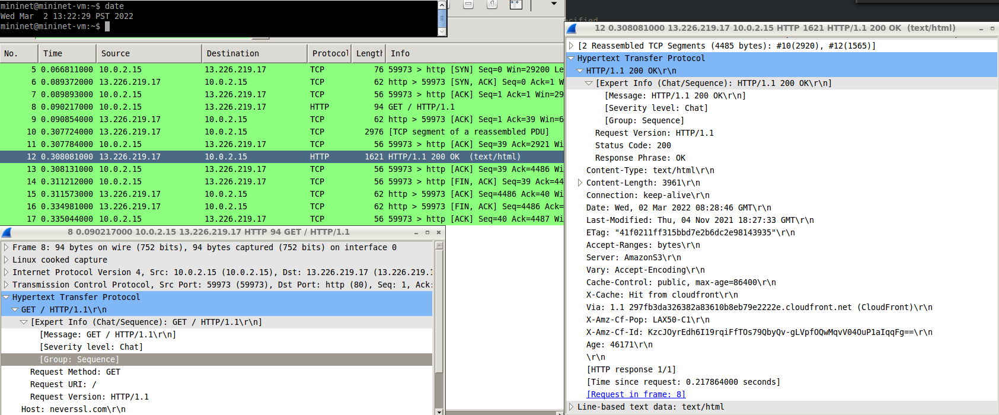

Curl output:
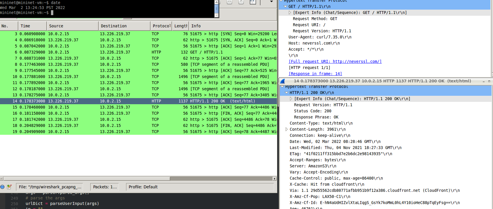

The program output seems to match the CURL output. the TCP connection was successful, and the response was 200 OK for both commands.

### Test 2: http://softwareqatest.com/

Program output:
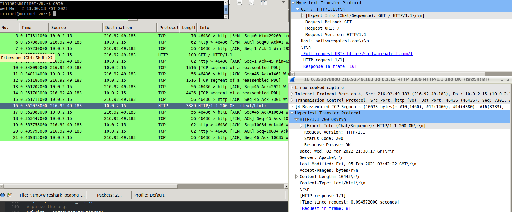

Curl output:
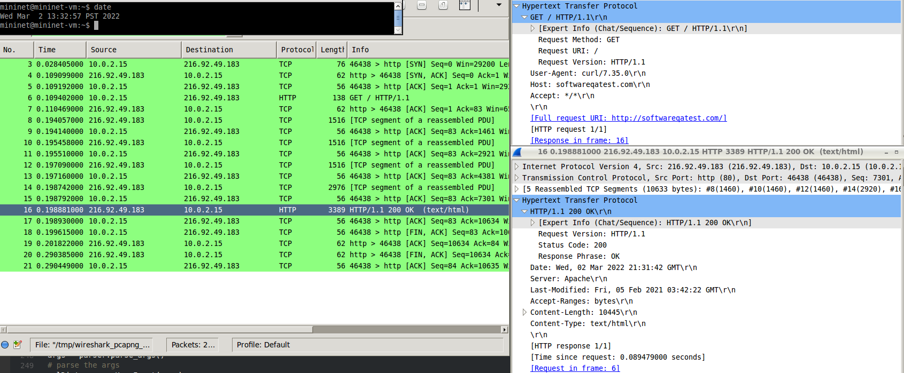

The program output seems to match the CURL output. the TCP connection was successful, and the response was 200 OK for both commands.

### Test 3: http://www.example.com/anyname.html

Program output:
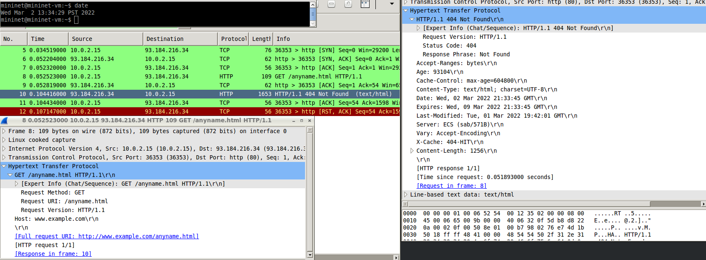

Curl output:
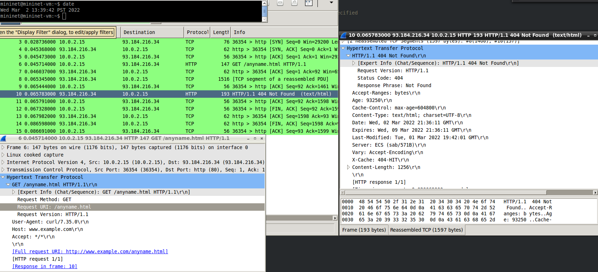

Both our program and Curl establish a TCP connection, send the GET request, and receive a response of 404 Not Found. However, my program closes the socket upon an unsuccessful response, so that is why there is an RST packet. An RST packet indicates that the client no longer needs data from the server. Curl, on the other hand, continues to receive content from the server. 

### Test 4: http://wwwexample.com/index.html 
Program output:
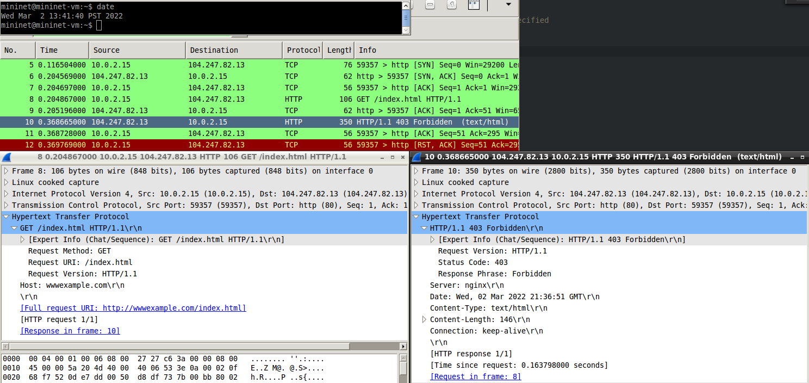

Curl output:
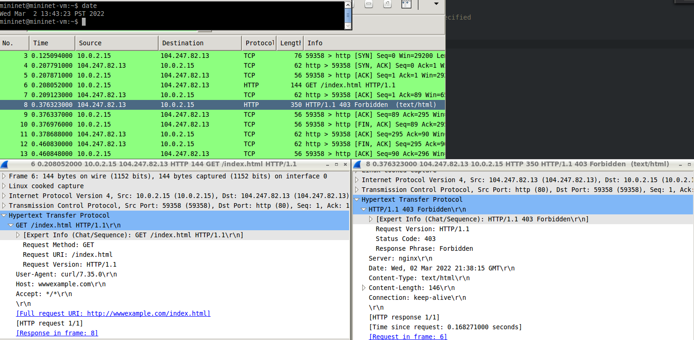

This output comparison is similar to test 3, except that instead of returning a 404 Not Found, the program and Curl return 403 Forbidden.


### Test 5: http://www.nintendo.com

Program output:


Curl output:
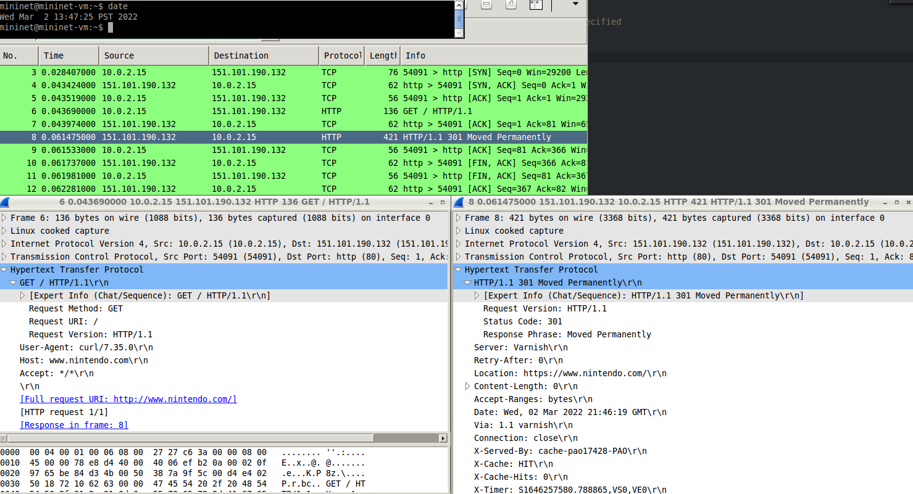

The program and Curl output match. An HTTP GET request is successfully sent, and a response of 301 Moved Permanently is returned. The TCP connection is established and closed.

### Test 6: http://www.google.com:443

Program output:
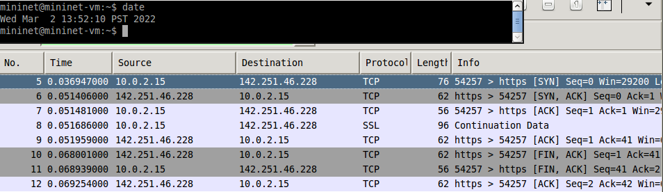

Curl output:
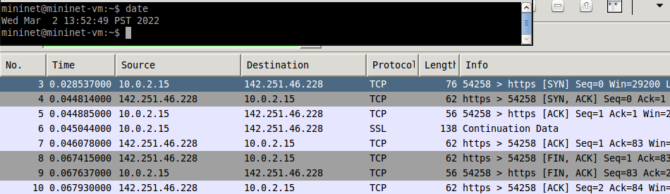

The program output seems to match the CURL output. Wireshark doesn't seem to be outputting HTML packets for either program. What we can see from these outputs, however, is that there is an SSL packet, which indicates that port 443 was used. 